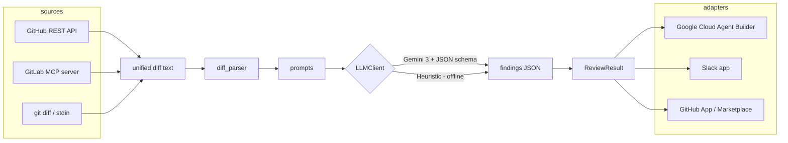
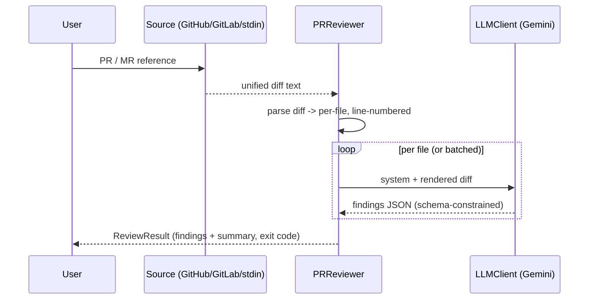

# Architecture

`pr-review-agent` keeps a small, dependency-free **review engine** separate from
**sources** (where diffs come from) and **adapters** (where it runs). The same
engine powers every hackathon target and the eventual GitHub Marketplace app.

## Components

## Review sequence

## Module map

| Module | Responsibility |
|---|---|
| `diff_parser` | unified diff -> `FileDiff` with new-file line numbers |
| `prompts` | system prompt, per-file & batch prompts, `RESPONSE_SCHEMA` |
| `reviewer.PRReviewer` | orchestration; per-file or batched; lenient JSON parse |
| `llm/gemini` | Gemini backend with structured-output schema |
| `llm/mock` | offline `MockLLMClient` (tests) + `HeuristicLLMClient` (demo) |
| `sources/github` | fetch a PR diff via the GitHub REST API (stdlib) |
| `adapters/*` | per-platform glue (Google Cloud, Slack, GitHub App) |

**Why this shape:** each hackathon mandates a different orchestration layer, so
all platform specifics live in `adapters/` and the reusable logic stays in
`reviewer` + `prompts` + `diff_parser` (zero third-party deps).
